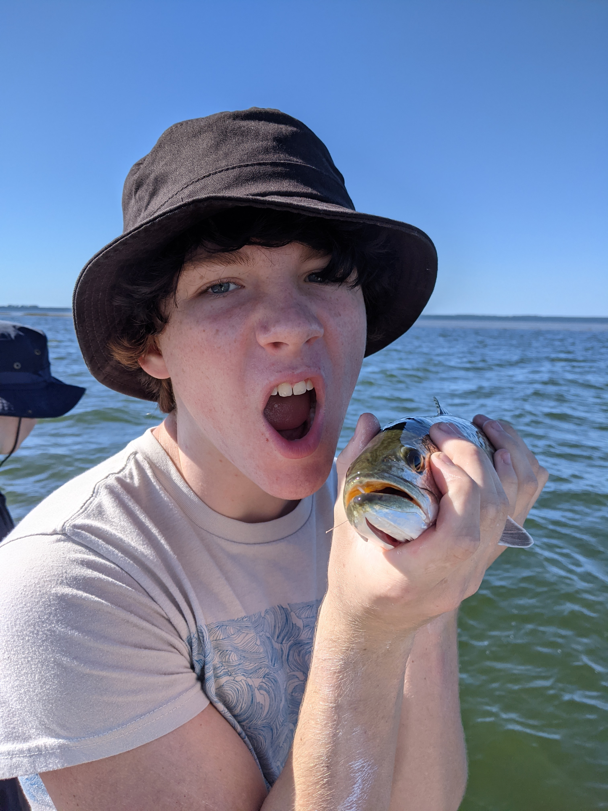
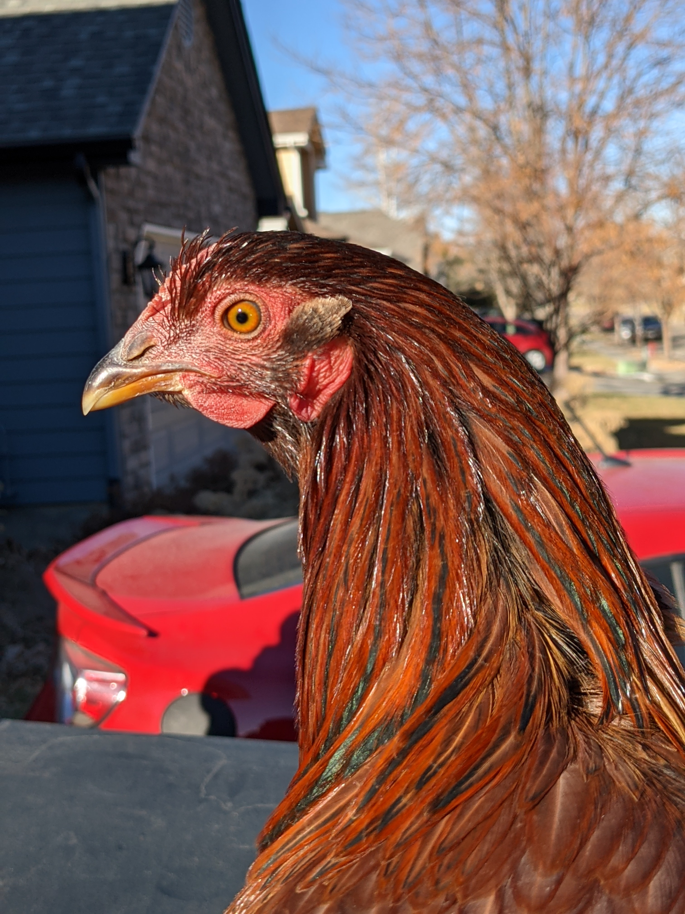

# neo4j-image-search

This example comprises a Python script (`main.py`) that writes a node to the graph for each photo in the photos folder. Each node contains the filename, and an array of 1001 floats generated by a Tensorflow neural net.

The following Cypher statement creates `[IS_SIMILAR_TO]` joins between _all_ the nodes. Each join has a property with the Cosine similarity score.

    MATCH (photoA:Photo)
    MATCH (photoB:Photo)
    WITH photoA, collect(photoB) AS photos
    UNWIND photos AS photoB
    WITH photoA, photoB, gds.alpha.similarity.cosine(photoA.classification_list, photoB.classification_list) AS similarity
    MERGE(:Photo {filename: photoA.filename})-[rel:IS_SIMILAR_TO {cosineSimilarity: similarity}]-(:Photo {filename: photoB.filename})

The self-relationships and poor matches (e.g. where the Cosine similarity is less than 0.6) are removed:

    MATCH(m:Photo)-[rel:IS_SIMILAR_TO]-(n:Photo)
    WHERE m.filename = n.filename
    OR rel.cosineSimilarity < 0.6
    DELETE rel

The relationships beween the first two pairs of images were not deleted because they relatively high Cosine similarity scores:

photoA                                                   |  photoB                                                  | Cosine similarity
:-------------------------------------------------------:|:--------------------------------------------------------:|:------------:|
 |  | 0.82
                   |                 | 0.63
                      |                    | 0.04

Once the graph has been built, similar images can be retrieved with a simple Cypher query in a few, short milliseconds, e.g.

    MATCH(p:Photo {filename: 'PXL_20201124_182915588.jpg'})-[rel:IS_SIMILAR_TO]-(q:Photo) RETURN p, rel, q

## Caveats
* Creating relationships between every node doesn't scale. The relationships should only be created if they're needed. It doesn't make sense to create relationships, and then delete them if they have weak Cosine similarity scores.
* This uses a pre-canned TensorFlow neural net. There are a ~1000 attributes that describe very general things, e.g. `electric guitar`, `refrigerator`, `stethoscope`, `vase`, etc... If you have a domain-specific use-case (e.g. makes/models of vehicles, people/clothing, etc...), it'd make sense to train your own neural network model. At the very least, experiment with other pre-trained neural nets on [TensorFlow Hub](https://tfhub.dev/).
* Geo/time has not been considered and that could reduce the number of images to evaluate when creating relationships.
